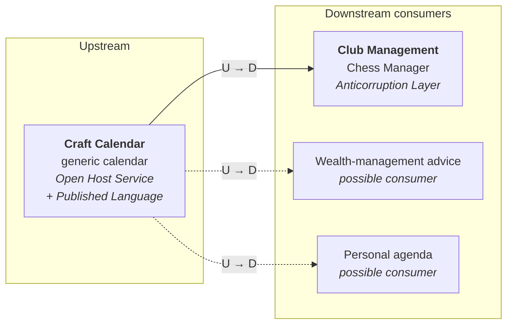
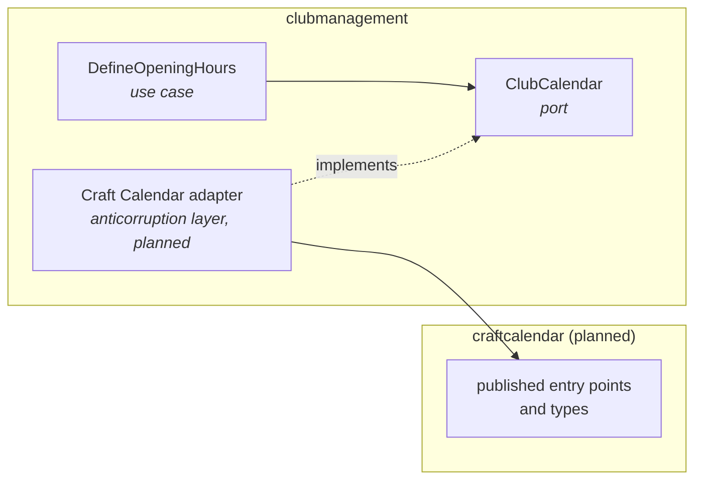

# Chess Manager

Chess Manager is a learning project built progressively with Domain-Driven Design,
Test-Driven Development and Clean / Hexagonal Architecture principles.

## Current bounded context: Club Management

The model separates three aggregate roots:

- `Person`: personal identity (`PersonId`), names, optional email, FIDE identification and rating.
- `Club`: club identity (`ClubId`), name, and whether the application manages the club.
- `ClubRelationship`: one relationship identified by the pair `PersonId` + `ClubId`,
  its recorded status and its FFE licenses by season.

`ClubRelationship` holds identifiers, never `Person` or `Club` objects. Neither
`Person` nor `Club` contains a collection of relationships. `PROSPECT`, `MEMBER`
and `PARTNER` describe relationships, not types of people. There are no separate
bounded contexts or microservices for these aggregates.

## Planned bounded context: Craft Calendar

Craft Calendar is a generic calendar and scheduling bounded context. Chess Manager is its first
consumer, through the opening hours of a club, but it is meant to serve other applications
too: a wealth-management advice application, a personal agenda, and so on. It therefore never
depends on chess: it knows neither clubs, players, the FFE, tournaments nor memberships. Its
language will grow from calendars, events, recurrences, time slots and exclusion periods, and
only as far as a requested use case demands it.

**Status.** This is a validated architectural direction, not existing code yet. The slice
*Define the opening hours of a club* depends on the `ClubCalendar` port. No example asks yet for
calendar behavior (dates of occurrence, exclusions, export), so Club Management stores the
sessions itself (`JdbcClubCalendar`): Craft Calendar would only have stored the same data under
other names. It will be extracted behind the same port when an example needs real calendar
behavior; the use case and the domain will not change.

### Context map

The two contexts do not share their models. Club Management says "the club opens every Friday
from 20:00 to 22:00 for free play, at its playing venue"; Craft Calendar will say something like
"weekly recurrence, Friday, 20:00–22:00, at this address". The translation is explicit and lives
in one adapter.



- **Craft Calendar is upstream, as an Open Host Service with a Published Language.** It serves
  several consumers and bends to none of them: it publishes one protocol, in its own language.
- **Club Management is downstream, behind an Anticorruption Layer**: its `ClubCalendar` port and
  an adapter translate club concepts (sessions, activities, the playing venue of the club) into
  the published language, and back. The `Club` aggregate never depends on a Craft Calendar class
  and computes no recurrence.
- **Rejected relationships.** *Conformist*: the club model would end up speaking in recurrences.
  *Shared Kernel*: it would tie the life cycles of both contexts and forbid extracting Craft
  Calendar. *Partnership*: it assumes two teams releasing in step, which makes no sense for a
  generic context. *Separate Ways*: the need is real.
- *Customer–Supplier* describes how the work is organized (the chess needs drive the backlog of
  Craft Calendar), not how the models relate.

### Dependency direction inside the modular monolith

A bounded-context boundary is not a deployment boundary. Both contexts will live in the same
Spring Boot application and the same JVM, with no shared transaction: Club Management calls
Craft Calendar as if the call were already remote.



Only the adapter may depend on Craft Calendar, and only on what it publishes; Craft Calendar
never depends on `clubmanagement`. ArchUnit will enforce both rules once the `craftcalendar`
package exists.

### Path to a separate back-end

The boundaries are drawn so that Craft Calendar can be extracted later without rewriting the
domain of Club Management:

1. **In-process call**: the adapter calls the public Java entry points of Craft Calendar.
2. **Separate Maven module**: Club Management depends only on the published artifact, so the
   compiler guards the boundary.
3. **HTTP API**: Craft Calendar exposes its published language over HTTP, checked by a contract
   test; an HTTP adapter implements the same `ClubCalendar` port. Only the wiring changes.
4. **Separate deployment**: its own application and its own PostgreSQL database; outbound
   adapters such as Google Calendar or iCalendar belong to Craft Calendar.

Out of scope for now: excluding school holidays (Chess Manager would translate commune →
academy → zone → holiday periods into generic exclusion periods; Craft Calendar knows none of
them), and subscribing to the calendar of a club from an external agenda.

## Relationship and affiliation rules

- A person can be a prospect of several clubs before obtaining a license.
- Recording an A or B license makes the person a member of that club and affiliates
  them for the current season, including when registration happens during the season.
- A person cannot be affiliated with two clubs in the same season.
- Recording a license ends that person's other prospect relationships by default.
  An explicit request can instead preserve selected relationships as `PARTNER`.
- An affiliated person cannot be registered as a prospect of any club for that season.
- The relationship has one recorded status; it cannot be both prospect and member.
- Relationships belonging to other people are unaffected.
- Earlier seasonal affiliations are retained when a person changes club in a later
  season. Repeating the same affiliation preserves it; no new season is implicitly licensed.
- A partnership can be recorded with a club without licensing the person there and
  without changing their affiliation elsewhere.
- A person licensed for the season with a club the application does not manage is an
  external player. A club unknown to the application is, by definition, not managed.

The use cases receive the current `Season` explicitly. Calendar boundaries have not
been specified, so no calculation from today's date is implemented. The recorded
relationship status describes its last transition; current seasonal affiliation is
queried from the licenses for the requested season. Automatic status changes at season
expiry, partnership termination, and whether a member may also be a partner of the
same club are outside this slice. What an external player may access once logged in
belongs to a future authorization context, not to Club Management.

## Application boundary and persistence

`RegisterProspect` records a new person's names and email and a prospect relationship,
or registers an existing person with another club. Internal identity generation is
supplied to the use case so tests can use deterministic IDs.

`RegisterLicense` records a license for the supplied current season and coordinates
the consequences for other prospect relationships. `ClubAffiliations` holds the
cross-club business rules (one club per season and prospect eligibility).

`RegisterPartnership` records a partnership with a club. `IsExternalPlayer` answers
whether a person is an external player for a season, from their affiliation and the
club it refers to.

The use cases depend on three ports: `PersonRepository`, `ClubRelationshipRepository`
and `ClubRepository`. The relationship repository can find a pair, list a person's
relationships, save and remove a relationship; the club repository finds and saves
clubs. These are core-owned application ports. `ClubRepository` has a PostgreSQL
implementation (see below); the other ports are implemented only by in-memory test fakes.

`ClubCalendar` holds the opening hours of a club, as a set of sessions. Its in-memory fake and
its PostgreSQL implementation, `JdbcClubCalendar`, run the same tests (`ClubCalendarContract`),
so the fast tests that rely on the fake can be trusted. Defining the opening hours replaces the
previous sessions: `JdbcClubCalendar` deletes and inserts them in one transaction, so that a
failure in between cannot leave a club with no or partial opening hours. No test forces that
failure; it is a design decision, not a proven behavior. The transaction belongs to the adapter,
because the use case must not depend on Spring.

`ClubRelationship` is immutable. `registerLicense` returns a new state with the same
identity; the application must save that state. The fake keys records by the two IDs.
Application tests use the same repository for setup, action and assertions and reread
persisted state. Removing `save()` was checked to make the membership test fail.

## Walking skeleton: create a club over HTTP

Creating a club is the first use case wired end to end, from HTTP to PostgreSQL:

```
POST /api/clubs {"name": "Montargis"}  →  201 Created, Location: /api/clubs/<id>
```

| Package | Role |
|---|---|
| `clubmanagement.createclub.rest` | `CreateClubController` translates the HTTP request into a call to `CreateClub`. |
| `clubmanagement.createclub` | `CreateClub` saves a club managed by the application and returns its `ClubId`. |
| `clubmanagement.persistence` | `JdbcClubRepository` implements `ClubRepository` with SQL through Spring's `JdbcClient`. |
| `infrastructure` | `ChessManagerApplication` starts Spring Boot; `ClubConfiguration` wires the objects explicitly. |

The domain, the ports and the use cases carry no Spring annotation; Spring objects are
declared as `@Bean`s in `infrastructure`. In production, `CreateClub` receives random UUIDs.
See [Code organization: vertical slices](#code-organization-vertical-slices) for the whole layout.

The database schema is versioned by Flyway in `src/main/resources/db/migration`
(`V1__create_club_table.sql`). Flyway applies the missing migrations, in order, when the
application starts; an applied migration is never edited, a change is a new `V<n>` file.

Authentication is deferred: nothing checks yet that the caller is an administrator.

### Run the application locally

With a running Docker engine and Java 26:

```sh
mvn spring-boot:run
```

Spring Boot starts the PostgreSQL 18 service described in `compose.yaml`, connects to it,
and Flyway migrates the schema; the application listens on port 8080. The credentials in
`compose.yaml` only protect this local container. Docker Compose support is a
development-only dependency and is skipped during tests, which use Testcontainers.

`mvn spring-boot:run` activates the `dev` profile: at each start, `DevelopmentData` empties
the tables and creates a minimal set of **fictitious** clubs of the Loiret committee (45)
through the use cases — `DEMO01`, `DEMO02` and `DEMO03`. Anything created during a session
is therefore lost at the next start. Real club names and FFE identifiers are FFE data and
must not be committed. No other profile creates or deletes data.

```sh
curl -i -X POST localhost:8080/api/clubs -H 'Content-Type: application/json' -d '{
  "name": "Échiquier de Montargis", "committeeCode": "45", "ffeClubId": "DEMO04", "communeCode": "45208",
  "registeredOffice": {"street": "1 rue du Marché", "postcode": "45200", "town": "Montargis"},
  "playingVenue": {"street": "1 rue du Marché", "postcode": "45200", "town": "Montargis"}}'
```

## Opening hours of a club

The opening hours of a club are a set of weekly *sessions*: a day, a start time and an end time.

- A session may be for an activity, or for none. Activities form an open list: the screen
  proposes "jeu libre", "cours adultes" and "cours enfants", and a club may type others.
- A session takes place at any address; by default, at the playing venue of the club. That
  default is a reference, not a copy of the address: if the club moves its playing venue, the
  session follows it.
- Sessions may overlap, and their order does not matter.
- The administrator defines all the sessions at once: the new ones replace the previous ones.

```
GET /api/clubs/<id>/opening-hours   →  200 [{"day": "FRIDAY", "from": "20:00", "to": "22:00",
                                             "activity": "jeu libre", "venue": null}, …]
PUT /api/clubs/<id>/opening-hours   →  204 (a missing venue means the playing venue of the club)
```

## Front-end (Angular)

The Angular 22 application in `front-end/` is a separate npm project, not built by Maven.
It opens on the clubs managed by the application in a departmental committee: the
administrator types the number of their department and is shown each club with its commune
and its FFE identifier, sorted by name. A link leads to the French screen where the
administrator creates a club and is told whether the club has been created. Each club of the
list leads to its opening hours: the administrator sees the sessions already defined, adds or
removes sessions, and saves them all at once. It needs Node.js 22.22, 24.15 or 26 and npm.

| File | Role |
|---|---|
| `src/app/club-management/clubs-of-committee/clubs-of-committee.ts` | `ClubsOfCommittee` component: the clubs of the committee the administrator asks for. |
| `src/app/club-management/create-club/create-club.ts` | `CreateClub` component: the form and the creation outcome. |
| `src/app/club-management/create-club/commune-search.ts` | The communes matching what the administrator types. |
| `src/app/club-management/define-opening-hours/define-opening-hours.ts` | `DefineOpeningHours` component: the sessions of a club, with their activity and their venue. |
| `src/app/club-management/ports/opening-hours.ts` | `OpeningHours` port: read and define the opening hours of a club. |
| `src/app/club-management/http/http-opening-hours.ts` | `HttpOpeningHours` adapter: implements `OpeningHours` over the REST API. |
| `src/app/club-management/ports/clubs.ts` | `Clubs` port: what the club screens need, with no HTTP detail. |
| `src/app/club-management/ports/communes.ts` | `Communes` port: the communes of a departmental committee. |
| `src/app/club-management/http/http-clubs.ts` | `HttpClubs` adapter: implements `Clubs` over the REST API. |
| `src/app/club-management/http/http-communes.ts` | `HttpCommunes` adapter: implements `Communes` over the REST API. |
| `src/app/app.routes.ts` | The clubs of a committee at `/`, the creation of a club at `/clubs/new`, the opening hours of a club at `/clubs/<id>/opening-hours`. |
| `src/app/app.config.ts` | Provides the router and wires `Clubs`, `Communes` and `OpeningHours` to their HTTP adapters. |

As in the back-end, each slice has its own folder named after its use case (`create-club`);
the ports and their HTTP adapters are shared by the slices of Club Management.

The front-end holds no business rule; they stay in the back-end.

With the back-end running (`mvn spring-boot:run`):

```sh
cd front-end
npm ci
npm start
```

Open <http://localhost:4200>. During development, `proxy.conf.json` forwards `/api`
to the back-end on port 8080, so the browser only talks to port 4200 and the back-end
needs no CORS configuration. Every REST controller is served under `/api`
(`infrastructure.WebConfiguration`), so the paths of the API never collide with the paths of the
screens: reloading `/clubs/new` shows the screen instead of calling the API.

Component tests use Vitest with jsdom (no browser); the server is simulated with
Angular's `HttpTestingController`:

```sh
npm test -- --watch=false
npm run build
```

## Personal identity and FFE licenses

Personal equality depends on `PersonId`, not names. A person can exist without a
license or FIDE identifier. Replacing an assigned FIDE identifier is rejected;
non-positive FIDE IDs and negative ratings are rejected as before.

`FfeLicense` remains an immutable pair of `FfeId` and category A or B. Both are
required. Blank FFE IDs are rejected and supplied values are preserved without an
invented federation-specific format. Invalid license requests preserve saved state.
A valid license can replace the pair recorded for the same season, as in the previous
model; restrictions on changing an FFE identifier have not been specified.

The existing value objects remain in `clubmanagement/domain/member/vo` to limit package movement.
The former `Member` entity and `MemberId` have been replaced by `Person` and `PersonId`;
license and affiliation behavior now belongs to club relationships.

## Code organization: vertical slices

The back-end is organized by vertical slice inside the Club Management bounded context.
A slice is one use case, named after it, with its refusals and its inbound adapter:

```
clubmanagement/
  domain/                  shared model: Club, ClubRelationship, Person, value objects
  ports/                   shared ports: ClubRepository, ClubRelationshipRepository, ClubCalendar, Communes, PersonRepository
  createclub/              CreateClub, its refusals, rest/CreateClubController
  defineopeninghours/      DefineOpeningHours, rest/DefineOpeningHoursController
  openinghoursofclub/      OpeningHoursOfClub, rest/OpeningHoursOfClubController
  communesofcommittee/     CommunesOfCommittee, rest/CommunesOfCommitteeController
  clubsofcommittee/        ClubsOfCommittee, ClubOfCommittee, rest/ClubsOfCommitteeController
  isexternalplayer/        IsExternalPlayer
  recordperson/            RecordPerson
  registerlicense/         RegisterLicense
  registerpartnership/     RegisterPartnership
  registerprospect/        RegisterProspect
  updateperson/            UpdatePerson
  persistence/             JdbcClubRepository and JdbcClubCalendar, shared: the clubs and their opening hours
  insee/                   InseeCommunes, shared: the INSEE communes reference
infrastructure/            Spring Boot application, explicit wiring, development data
```

The domain model and the ports stay shared: an aggregate has one model, never one per
slice. Unit tests live in the package of what they test; the in-memory fakes live beside
the ports. Acceptance, architecture, end-to-end and infrastructure tests are
cross-cutting. ArchUnit enforces these boundaries (see below).

## Acceptance specifications and Cucumber

Cucumber 7.22.1 runs on the JUnit Platform alongside JUnit Jupiter 6.0.3.
All Cucumber dependencies are test-scoped; the domain has no framework dependencies.

- `src/test/resources/features/implemented`: domain specifications, some without Cucumber bindings.
- `src/test/resources/features/pending`: includes the implemented relationship scenarios
  alongside future specifications; `@acceptance` determines which scenarios run.
- `RunCucumberTests`: selects scenarios tagged `@acceptance`; they form the build gate.
- `acceptance/steps`: business-language steps using a scenario driver that calls application use cases.

Scenarios speak only the business language: actors, business actions and outcomes. They never
mention HTTP, URLs, status codes, JSON, SQL, screens, buttons or frameworks; those details
belong to step definitions, drivers and adapters. A scenario must stay true whether it runs
through a use case, the REST API or the user interface (see `AGENTS.md`, section 6).

The build gate covers prospect details, rejection of a licensed prospect, rejection
of membership without a license, default rupture of other prospect links for A and B
licenses, and explicit preservation as a partner. Scenarios about partnerships and
external players are bound and pass, but are still tagged `@to_implement`, so they are
outside the gate. Visitor approval and visitor data access remain to be implemented.

A scenario is *pending* when one of its steps is undefined or throws
`PendingException`. CI runs every scenario, outside the build gate, to report pending
and failing ones (see [Continuous integration](#continuous-integration-with-github-actions)).

See [the modeling correction report](docs/club-relationship-refactoring.md) for the
initial inventory, changes and TDD evidence.

## Run the tests

The Maven project targets Java 26 and inherits its dependency management from Spring
Boot 4.1.1, which sets JUnit Jupiter to 6.0.3. Use Eclipse
Temurin 26 (an open-source OpenJDK distribution) and Maven (no Maven wrapper is
currently included). Check that `mvn -version` reports Java 26 before running.

The persistence and end-to-end tests start a real PostgreSQL 18 with Testcontainers,
so a running Docker engine is required (for example OrbStack or Docker Desktop on
macOS; `docker version` must show a Server section). Without it, these tests fail.

```sh
mvn test
```

In IntelliJ, select Temurin 26 as the Project SDK and use the Project SDK for
the Maven importer and runner, then reload the Maven project. The compiler uses
`--release 26` without preview features. Java 26 or newer is required to run the
compiled application.

To run only the affiliation tests:

```sh
mvn -Dtest=affiliation.AffiliationsTests test
```

To run the selected Cucumber scenarios:

```sh
mvn -Dtest=RunCucumberTests test
```

The full `mvn test` command runs the JUnit tests and all selected acceptance
scenarios. Cucumber writes its HTML report to
`target/cucumber/cucumber.html`.

To run every scenario, including pending ones, as CI does (Cucumber exits with a
non-zero status while some scenarios are not passing; the report is still written):

```sh
mvn test-compile org.apache.maven.plugins:maven-dependency-plugin:3.11.0:build-classpath \
  -Dmdep.outputFile=target/test-classpath.txt -Dmdep.includeScope=test
java -cp "target/test-classes:target/classes:$(cat target/test-classpath.txt)" \
  io.cucumber.core.cli.Main --glue acceptance.steps \
  --plugin html:target/cucumber-all/cucumber.html classpath:features
```

Then open `target/cucumber-all/cucumber.html` and filter on `undefined` or `pending`.

In IntelliJ, reload the Maven project after changing `pom.xml`, then run
`RunCucumberTests` to use the same scenario selection as Maven. Editor recognition
of Java step definitions requires Cucumber for Java support in addition to Gherkin.

Use RED → GREEN → REFACTOR for new behavior. Rename and simplify existing code
under green tests, keeping domain language consistent and changes small.

## Code quality with SonarQube and JaCoCo

The build includes SonarScanner for Maven 5.6.0.6792 and JaCoCo 0.8.15.
JaCoCo measures production-code coverage during both JUnit and Cucumber tests.
SonarQube imports that coverage and performs its own static analysis.

Generate the coverage reports locally, without contacting a SonarQube server:

```sh
mvn clean verify
```

- HTML coverage report: `target/site/jacoco/index.html`.
- XML coverage report imported by SonarQube: `target/site/jacoco/jacoco.xml`.
- Cucumber acceptance report: `target/cucumber/cucumber.html`.

`mvn test` runs instrumented tests; `verify` also generates the coverage reports.
Reports remain under the ignored `target` directory. No arbitrary coverage
threshold or analysis exclusion is configured.

### Connect an analysis destination

An actual Sonar analysis requires a project on SonarQube Cloud or a SonarQube
server, its project key, and an analysis token. The repository does not yet select
a destination or configure an automatic CI analysis.

Set `SONAR_HOST_URL`, `SONAR_PROJECT_KEY` and `SONAR_TOKEN` in your local environment
or CI secret settings. Use the URL of the selected server or Cloud region. Keep
the token out of Git and command-line arguments.

For SonarQube Server:

```sh
mvn clean verify sonar:sonar -Dsonar.projectKey="$SONAR_PROJECT_KEY"
```

For SonarQube Cloud, also set `SONAR_ORGANIZATION` to the organization key:

```sh
mvn clean verify sonar:sonar \
  -Dsonar.projectKey="$SONAR_PROJECT_KEY" \
  -Dsonar.organization="$SONAR_ORGANIZATION"
```

These commands send the analysis to the configured destination; a successful
local coverage build alone does not mean a Sonar analysis has run. The scanner
and coverage plugin versions are pinned in `pom.xml`.

See the official [Maven scanner documentation](https://docs.sonarsource.com/sonarqube-cloud/advanced-setup/ci-based-analysis/sonarscanner-for-maven)
and [Java coverage documentation](https://docs.sonarsource.com/sonarqube-cloud/enriching/test-coverage/java-test-coverage).

## Mutation testing with PIT

PIT 1.25.9, with its JUnit 5 plugin 1.2.3, checks whether tests detect small
changes to production bytecode. Source files are not rewritten. It mutates every
class in `clubmanagement` except the adapters (`rest`, `persistence`, `insee`) and runs
every JUnit `*Tests` class against them, excluding `acceptance` (Cucumber repeats the
use-case tests more slowly), `architecture` (ArchUnit checks dependencies, not behavior),
and the adapter and `endtoend` tests (they start PostgreSQL, too slowly to run for each
mutation).

With Maven running on Java 26:

```sh
mvn test-compile org.pitest:pitest-maven:mutationCoverage
```

PIT runs only when explicitly requested; it is not bound to `test` or `verify`.
The first run downloads the plugin and its dependencies from Maven Central.

- HTML report: `target/pit-reports/index.html`.
- XML results: `target/pit-reports/mutations.xml`.
- On macOS: `open target/pit-reports/index.html`.

Reports are ignored by Git, overwritten on the next analysis, and removed by
`mvn clean`. Rerun mutation analysis to regenerate them.

Read each mutation alongside the business rule and the test that detects it:

- `KILLED`: a test failed after the mutation.
- `SURVIVED`: the mutation was exercised but no test detected it; investigate a
  missing example or assertion, or a mutation with equivalent observable behavior.
- `NO_COVERAGE`: no selected test exercised the mutated code.
- Timeouts and execution errors need investigation; they are not passing tests.

No mutation score threshold or value-object exclusion is configured, and the
default mutation operators are used. Surviving and uncovered mutants point to
missing examples or assertions; add tests for the meaningful behavioral gaps.
PIT complements JaCoCo coverage; a perfect score is not proof that every possible
defect is detected.

See the [PIT Maven documentation](https://pitest.org/quickstart/maven/)
and the [JUnit 5 plugin](https://github.com/pitest/pitest-junit5-plugin).

## Architecture tests with ArchUnit

ArchUnit 1.4.2 runs through JUnit Jupiter as a test-only dependency.
`architecture.ArchitectureTests` holds three rules over the production classes of
`clubmanagement` (the `..` pattern includes subpackages):

- `clubmanagement.domain..` depends on no other part of the context (slices, ports,
  adapters) nor on `infrastructure..`;
- outside the adapters (`..rest..`, `clubmanagement.persistence..`,
  `clubmanagement.insee..`), no class depends on `org.springframework..`, on
  `infrastructure..` or on an adapter: the hexagon's core stays free of the framework
  and of the adapters around it;
- the slices (`clubmanagement.(*)..`) do not depend on each other; they may all depend
  on the shared `clubmanagement.domain` and `clubmanagement.ports`.

The rules import compiled production classes, excluding test classes, and check
dependencies such as field types, method signatures, annotations and calls.

Run the architecture rules with Maven on Java 26:

```sh
mvn -Dtest=architecture.ArchitectureTests test
```

It also runs automatically with `mvn test` and `mvn verify`. Results appear in
`target/surefire-reports`. Update the adapter package patterns when an adapter is added.

See the [ArchUnit user guide](https://www.archunit.org/userguide/html/000_Index.html).

## Continuous integration with GitHub Actions

The [CI workflow](.github/workflows/ci.yml) runs on pull requests, pushes to `main`
and manual dispatches. Its `Tests and mutation analysis` job uses Ubuntu 24.04,
Eclipse Temurin Java 26 and Maven, with a cache of Maven dependencies.

The job runs these steps in order:

1. The unit tests of the report script (`.github/scripts/test_ci_report.py`).
2. `mvn clean verify`: compiles and packages the project, runs JUnit (including
   ArchUnit) and the Cucumber build gate selected by `RunCucumberTests`, and creates
   the JaCoCo reports.
3. A report-only Cucumber run of every scenario, through Cucumber's command-line
   runner. Pending or failing scenarios do not fail this step; a missing report does.
4. PIT on the scope configured in `pom.xml`.
5. `.github/scripts/ci_report.py`, which writes the run summary and assembles the
   report site.

A separate `Front-end tests and build` job uses Node.js 26 with a cache of npm
dependencies. In `front-end/`, it installs the dependencies from the lockfile
(`npm ci`), runs the component tests and builds the application. A failing test or
build error fails this job.

A compilation failure, failing test, architecture violation, failing build-gate
scenario or PIT execution error fails the back-end job. As in local development, no JaCoCo or
mutation-score threshold is enforced: a surviving mutant alone does not fail the job.

Reports are available in three places:

- **Run summary**: on the run page, a table of test counts, coverage and mutation
  score, followed by the pending scenarios with links to their source lines.
- **GitHub Pages**: <https://sebmace.github.io/chess-manager/> publishes the same
  summary with the JaCoCo, PIT and Cucumber HTML reports. The Cucumber report covers
  every scenario; filter it on `undefined` or `pending`. The site is updated by the
  `Publish reports to GitHub Pages` job after each successful push to `main`, and is
  public. Pages must use **Settings → Pages → Source: GitHub Actions**.
- **Artifact**: **Actions → CI → the run → Artifacts → test-reports** contains the
  raw Surefire results and both Cucumber reports. It is uploaded even after a failure
  and retained for 14 days; reports from steps that did not complete may be absent.

The workflow requires no project secret and performs no Sonar analysis. Only the
publishing job receives the `pages: write` and `id-token: write` permissions.
Actions are pinned to commit hashes, with their release versions in comments; the
Maven dependency plugin used by step 3 is pinned by version. A newer run on the same
Git ref cancels an older in-progress run.

After the first successful GitHub run, the repository's branch rules can require
the `Tests and mutation analysis` status check before merging into `main`.
Adding this workflow does not itself enable that repository setting.

## License and authorship

MIT License. Created by Sébastien Macé.
Human contributors remain responsible for reviewing and understanding their contributions.
